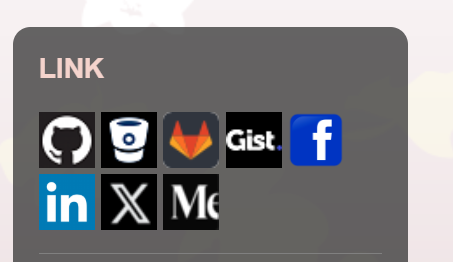

# Link images

</br>

* **How to Make Image for Links**                    
    1. google image search           
    2. download image(png)         
    3. image cut and resize 32x32         
    4. make a link and img tag below    



</br>

> [!TIP]      
> 간혹, 32x32 제약 때문에 Image가 너무 손상되는 경우 image에서 크게 하고 직접 사용하자 
>

</br>

[Go Back Link Setup](./blogger_info.md#blogger-linksetup)      

</br>

## STEP.1 Find Image

</br>

Seach following images (like icons) in Google                            
 


</br>

## STEP.2 Resize 32x32 Png (Option)       

</br>

Select one of them and then Resize it 

 

* How to resize 32x32            
    https://www.iloveimg.com/resize-image

</br>

## STEP.3 Chanage Png to Base64

</br>

* How To make base64 data  
     https://onlinepngtools.com/convert-png-to-base64

</br>

## STEP.4 Make Link based on Base64      

</br>


* Backup Images(Base64)       
    * [Go to Medium Image](./links/base64_medium.md)       
    * [Go to Twitter Image](./links/base64_twitter.md)    
    * [Go to ALL Backup](./links/base64_all.md)        


</br>

e.g. 
```
<!--  32x32 Twitter Start -->

<a href="https://twitter.com/Ahyuo79">


</a>

<!--  32x32 Twitter End -->

```

</br>