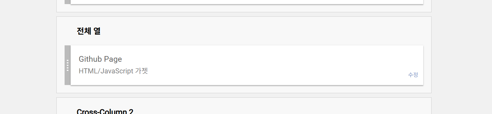
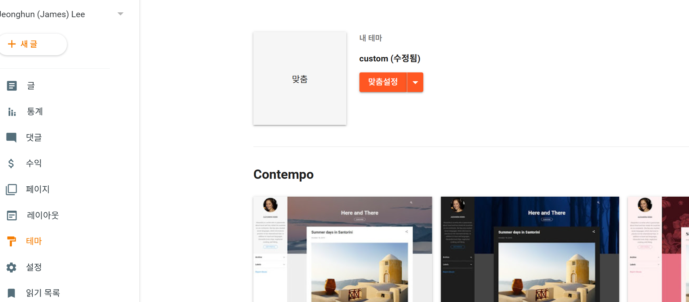

# Google Blog 

</br>

구글 Blogger 는 반드시 Github Page가 배포 후 아래와 같이 설정 진행  

[Go To Blogger Setup](./blogger_info.md#blogger-setup)     

</br>


## Blogger Setup (All Gadget and CSS) 

</br>

Google Blog의 나만의 Java Script 과 나만의 CSS 적용하여 사용 중 이를 버전별로 관리   

* 레이아웃->전체 열  
    * HTML 별도 추가 (Github Page)    
    

</br>

* 전체 열 -> Github HTML 추가          
아래 Github Release 내용 추가          
```
<!-- Jeonghun's Github Page START  -->
    <script defer='defer' src='https://JeonghunLee.github.io/blogspot/jeonghun-latest.js'></script>
    <link href="https://JeonghunLee.github.io/blogspot/jeonghun-latest.css" rel="stylesheet" />                
<!-- Jeonghun's Github Page END  -->
```

</br>

* 테마->맞춤설정 
    * 반드시 Custom 설정해야 Google 에서 적용되어진 Template들을 안 사용     
    


</br>

