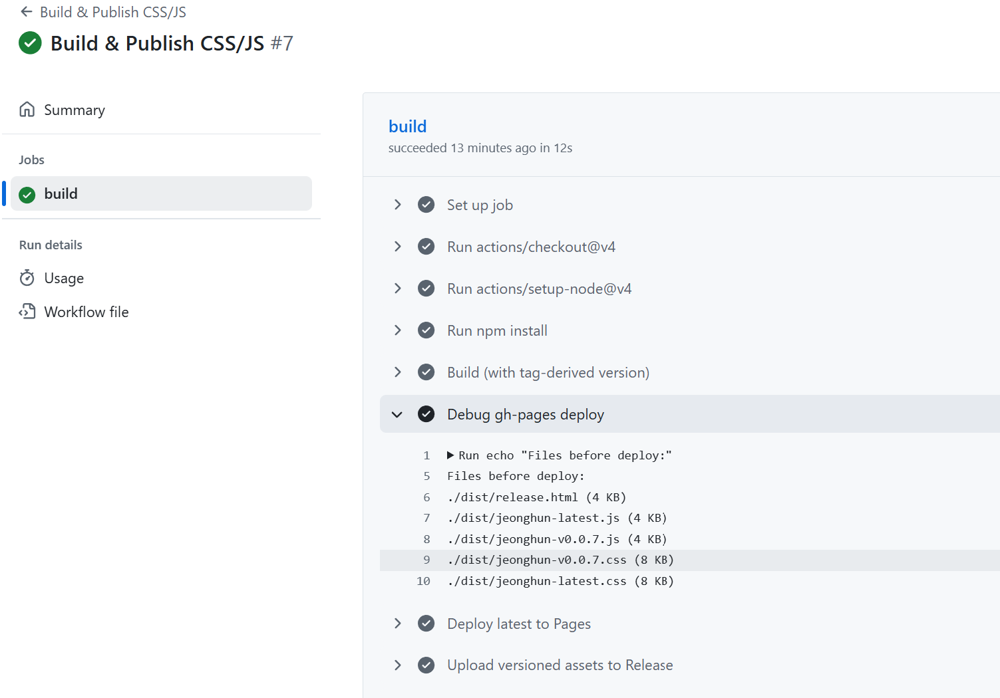

# Github 관리  

</br>

* 기본동작방식 
    * Github Action CI/CD 방식의 자동화 

</br>

* Github Action 동작 
    * Github Action 에서 아래의 작업을 자동화 
        * v Tag가 있을 경우 진행   
        * 먼저 항상 가상으로 테스트 진행   

</br>

* Node.js에서 ESM(ECMAScript Module) 의 Package 이용 
    * esbuild.mjs
    * package.json (esbuild.mjs 자동실행)
```
  "scripts": {
    "clean": "rimraf dist",
    "build": "node esbuild.mjs",
    "release": "npm run clean && npm run build"
  }
}
```

상위 Package Javascript을 이용하여 Package 후 이를 배포 진행     

</br>

[Go Back Index](index.md)

</br>

## 전체구조      

</br>

* src 전체구조 
Input File 구조 이지만, html 부분은 output     
```
src/
    css/index.css     --> 각 Blog의 HTML 분석 후 각 부분 변경 
    js/index.js       --> 각 Blog 의 HTML 분석 후 각 부분 변경   (세련미를 주기위해 sliding 방식사용)   
    html/releae.html --> 최종 releas format 
```

</br>

* Input File 
    * css/index.css
    * js/index.js 
    * html/release.html    
        * format 만 사용하고 version만 변경해서 기록   

</br>

* Output File and Branch     
    * gp-pages   **(Github Pages)**    
        * jeonghun-latest.css
        * jeonghun-latest.js
        * jeonghun-v0.0.6.css
        * jeonghun-v0.0.6.js
        * release.html   // update release version    

</br>

## Github Action 전체동작 

</br>

* package.json 
    script 에 의해 자동실행  

```
      - run: npm install

      # 0) Build Step (esbuild.mjs) 
      #   esbuild -> package.json -> "release": "npm run clean && npm run build"
      - name: Build (with tag-derived version)
        run: npm run release
```


</br>

* gh-pages branch 
```
      # 1) gh-pages 브랜치로 dist 전체 업로드
      - name: Deploy latest to Pages
        uses: peaceiris/actions-gh-pages@v4
        with:
          github_token: ${{ secrets.GITHUB_TOKEN }}
          publish_dir: ./dist
          # 이 액션은 dist 내용을 gh-pages 브랜치에 푸시합니다.
          # 저장소 Settings → Pages → Branch: gh-pages / root 로 설정.

      # 2) Release Upload 
      - name: Upload versioned assets to Release
        if: startsWith(github.ref, 'refs/tags/')
        uses: softprops/action-gh-release@v2
        with:
          files: |
            dist/jeonghun-v*.css
            dist/jeonghun-latest.css
            dist/jeonghun-v*.js
            dist/jeonghun-latest.js
```


</br>

### Github Action (latest문제)

</br>

* Build       
    아래와 같이 다 생성되어지짐 


</br>

* 주의 
    * 이전 Version 과 큰 차이가 없다면, latest.x 업데이트가 아래와 같이 되지 않음 
    * 그나마 rename 했기 때문에 변경되어짐   


</br>

## Github Pages 연동   

</br>

Github Page를 연동하여, Blogger에서 가져다 사용해야 하므로 반드시 확인    

* Setting 


</br>

## Github 배포확인  


</br>

* **Github Page 확인(gh-pages)**        
    * 아래 최종 File 들 확인       
    https://github.com/JeonghunLee/blogspot/tree/gh-pages    


</br>


* **Release(옵션)**
    * 상위에서 언급되어진 files들이 업데이트          
    * https://github.com/JeonghunLee/blogspot/releases

</br>


## Blogger 배포 

</br>

Google Blog에서 가져다 쓸 Javascript와 CSS를 의미하며, 이곳에서는 배포버전의 방식   

</br>

* **변경방식(배포방법)**   
    * latest version : **Blog에서 수정할 필요 없이 쉽게 변경**  
    * version 명시 : 매번 Blog에서 특정 버전으로 변경    


</br>

각 배포방법을 2가지 제공하며, 가급적 Latest를 써야 Bloger에서 수정할 필요가 없다       

</br>

### latest 방식-1  

</br>

* 항상 **최신 추적**
    * 아래와 같이 버전에 상관 없이 적용방법 
    * [gh-pages](https://github.com/JeonghunLee/blogspot/tree/gh-pages/)    
    * [release.html](https://github.com/JeonghunLee/blogspot/tree/gh-pages/release.html)    
```
    <!-- Jeonghun's Github Page v0.0.7 Start -->
    <script defer src="https://JeonghunLee.github.io/blogspot/jeonghun-latest.js"></script>
    <link rel="stylesheet" href="https://JeonghunLee.github.io/blogspot/jeonghun-latest.css"></link>
    <!-- Jeonghun's Github Page v0.0.7 End -->
```

</br>

### version 방식-1  

</br>

* 문제 시 즉시 롤백 (버전 고정 사용)
    * 특정 버전으로 관리 방법    
    * [gh-pages](https://github.com/JeonghunLee/blogspot/tree/gh-pages/)    
    * [release.html](https://github.com/JeonghunLee/blogspot/tree/gh-pages/release.html)

```
    <!-- Jeonghun's Github Page v0.0.7 Start -->
    <script defer src="https://JeonghunLee.github.io/blogspot/jeonghun-v0.0.7.js"></script>
    <link rel="stylesheet" href="https://JeonghunLee.github.io/blogspot/jeonghun-v0.0.7.css"/>
    <!-- Jeonghun's Github Page v0.0.7 End -->
```


</br>

##
<p align="center"><sup>© 2025 Jeonghun (James) Lee | </sup><a href="index.md#github-관리방법"><sup>Table of Contents</sup></a></p>