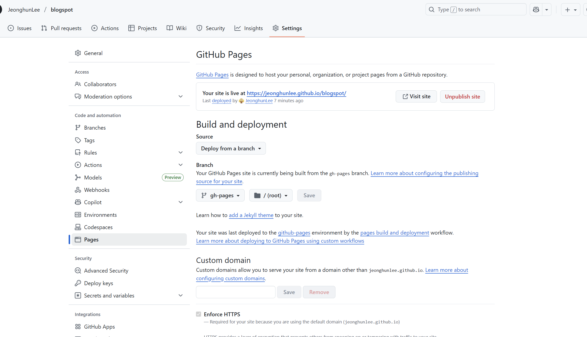

# Java Script 과 CSS 관리   

</br>

Google Blog의 나만의 Java Script 과 나만의 CSS 적용하여 사용 중 이를 버전별로 관리   

* 맞춤설정 
    * HTML 수정     
    

</br>

## 전체구조      

</br>

```
src/
    css/index.css     --> 각 Blog의 HTML 분석 후 각 부분 변경 
    js/index.js       --> 각 Blog 의 HTML 분석 후 각 부분 변경   (세련미를 주기위해 sliding 방식사용)   
    html/releae.html --> 최종 releas format 
```

</br>


## Github Pages 연동   

</br>

Google Blog Theme과 My Google Blog를 관리하는 게 목표

* Setting 



</br>

## Blogger 변경 전 확인   


</br>

* Release  후 변경확인  
    * 아래 최종 File 들 확인       
    https://github.com/JeonghunLee/blogspot/tree/gh-pages


</br>

* Release          
    https://github.com/JeonghunLee/blogspot/releases

</br>

## Blogger 변경 방법 

</br>

* **변경방식**   
    * latest version : Blog에서 수정할 필요 없이 쉽게 변경 
    * version 명시 : 매번 Blog에서 특정 버전으로 변경    


</br>

### latest 방식-1  

</br>

* 항상 **최신 추적**
    * 아래와 같이 버전에 상관 없이 적용방법 
```
    <!-- Jeonghun's Javascript/css  -->
    <script defer src="https://JeonghunLee.github.io/blogspot/jeonghun-latest.js"></script>
    <link rel="stylesheet" href="https://JeonghunLee.github.io/blogspot/jeonghun-latest.css"></link>
    <!-- Jeonghun's Javascript/css End -->      

```

</br>

### version 방식-1  

</br>

* 문제 시 즉시 롤백 (버전 고정 사용)
    * 특정 버전으로 관리 방법    
    * [gh-pages](https://github.com/JeonghunLee/blogspot/tree/gh-pages/)    
    * [release.html](https://github.com/JeonghunLee/blogspot/tree/gh-pages/release.html)
```
    <!-- Jeonghun's Javascript/css Start -->
    <script defer src="https://JeonghunLee.github.io/blogspot/jeonghun-v0.0.3.js"></script>
    <link rel="stylesheet" href="https://JeonghunLee.github.io/blogspot/jeonghun-v0.0.3.css"></link>
    <!-- Jeonghun's Javascript/css End -->    

```


</br>
